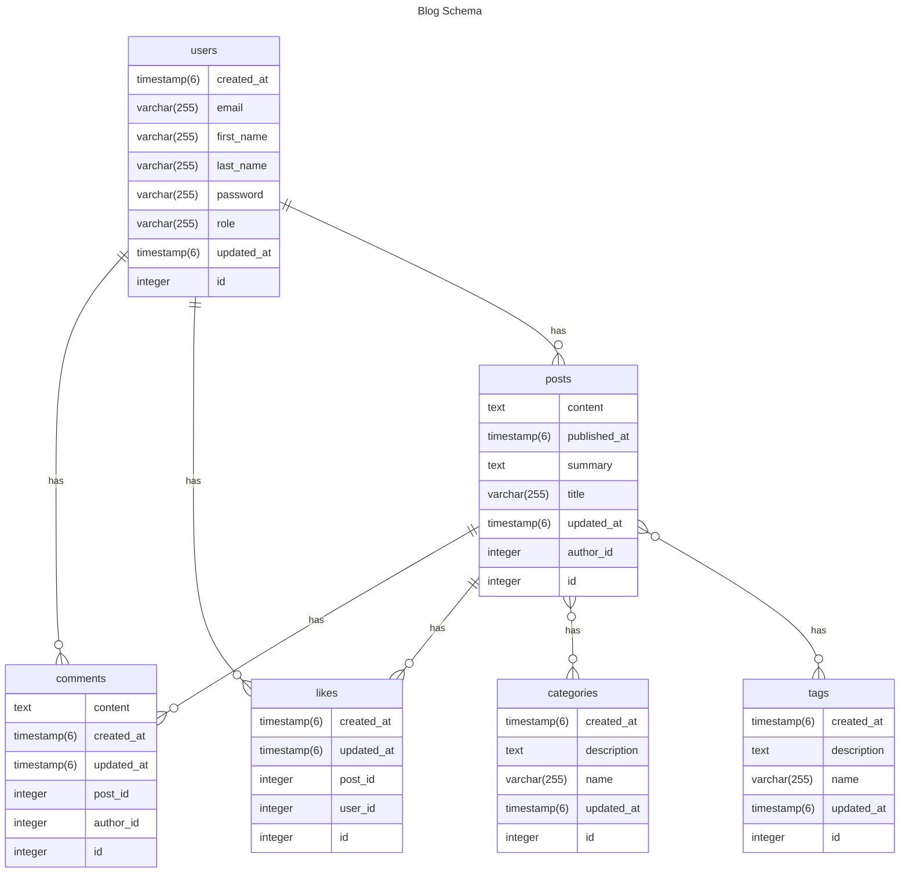

# blog-api

This is a Spring Boot application for a blog platform. It provides functionality for managing blog posts, categories, tags, users, comments, and likes. The application is built using the Spring Boot framework and utilizes a database to store the blog data.


#### Discover endpoints of bank System
[](https://documenter.getpostman.com/view/26079619/2sA3duHDrm)

## Functionality
The Spring Boot blog application provides the following functionality:
- **Posts**: Allows users to create, read, update, and delete blog posts. Each post has a title, content, summary, publication date, and author.
- **Categories**: Enables categorization of blog posts. Categories have a name, description, and can be associated with multiple posts.
- **Tags**: Provides a way to tag blog posts with keywords. Tags have a name, description, and can be associated with multiple posts.
- **Users**: Manages user accounts for the blog platform. Users have an email, first name, last name, password, role, and can create posts, leave comments, and like posts.
- **Comments**: Allows users to leave comments on blog posts. Comments have content, creation date, and can be associated with a specific post and author.
- **Likes**: Enables users to like blog posts. Likes have a creation date and are associated with a specific post and user.


### Technologies Used
- **Spring Boot**: Framework to build the application
- **Spring Data JPA**: For data persistence
- **Spring Security**: For authentication and authorization
- **PostgreSQL**: Database for storing blog data
- **Lombok**: To reduce boilerplate code
- **JWT (JSON Web Token)**: For securing API endpoints
- **Maven**: For project build and dependency management


### ERD



## Requirements
- Java Development Kit (JDK) 17 or above
- PostgreSQL Database (You can either use a local PostgreSQL instance or connect to a remote one)
- If you are running a local PostgreSQL instance, update database credentials from `application.properties`.

## How to Run
1. Clone the project repository from Git (if it's not already cloned).
2. Import the project into your favorite Java IDE (e.g., IntelliJ, Eclipse, etc.).
3. Build the project to resolve dependencies.


## How to Run Using Maven
To run the Spring Boot application using Maven, follow these steps:

1. Open a terminal (command prompt) window or a terminal within your IDE.

2. Navigate to the root directory of the Spring Boot project, where the `pom.xml` file is located.

3. Build the project using Maven by executing the following command:

   ```bash
   mvn clean package
   ```

   This command will compile the Java code, run tests, and package the application into a JAR file.

4. Once the build is successful, you can run the Spring Boot application using the following command:

   ```bash
   mvn spring-boot:run
   ```

   Maven will start the embedded Tomcat server and deploy your application. You should see logs indicating that the application is running.

5. By default, the application will be accessible at `http://localhost:8080`. Open your web browser and navigate to this URL to access the application.

6. If you need to stop the running application, you can press `Ctrl + C` in the terminal where the application is running. This will terminate the Spring Boot application.

**Note:** Ensure that you have properly configured the properties, such as the database URL, username, and password, in the `application.properties` file before running the application. Also, make sure that your PostgreSQL database is running and accessible before starting the Spring Boot application.

Now, you can interact with your Spring Boot application through the specified endpoints and test its functionality.

## How to Contribute

We welcome and encourage developers to contribute to the project and help us make it even better. If you are interested in contributing, follow these steps:

- **Fork the Repository**
- **Make your Changes**
- **Create a Pull Request**
- **Wait for Review**: Your pull request will be reviewed by the project maintainers. Make any necessary changes based on their feedback.

**👏🏻👏🏻 Congratulations! 🎉🎊** Your contribution has been accepted and merged into the main repository. You are now a contributor to the project.

---


## Contact
Ahmed Alhalwagy | [@alhalwagy](https://github.com/alhalwagy)
